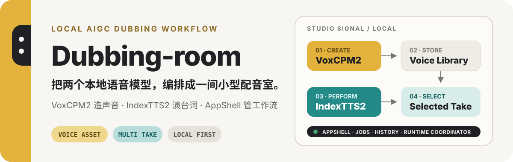
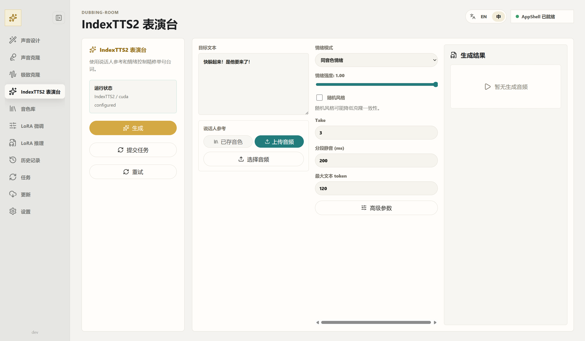
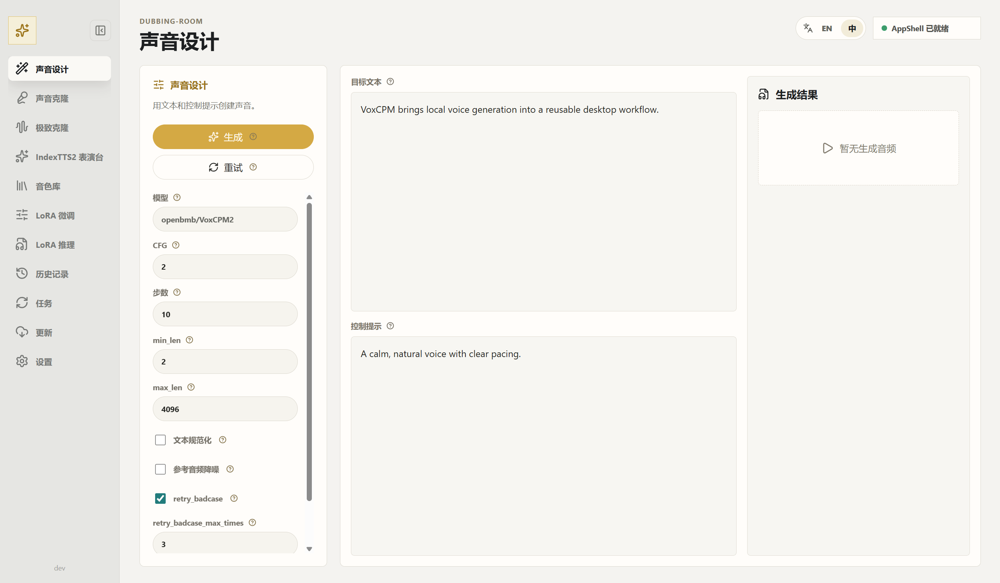
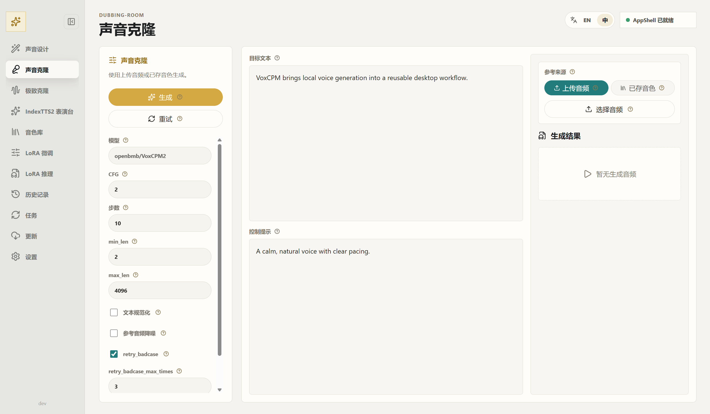
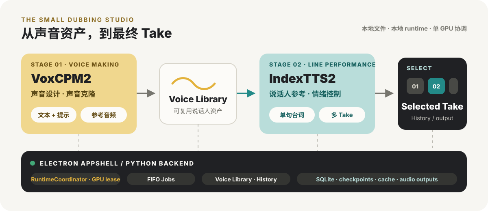

<p align="center">
  
</p>

<p align="center">
  <strong>本地运行 · 双模型分工 · 声音资产 · 多 Take · 任务与历史</strong>
</p>

<p align="center">
  <a href="#先看配音室">产品截图</a> ·
  <a href="#一条完整的配音链">工作流</a> ·
  <a href="#快速开始">快速开始</a> ·
  <a href="#当前状态">当前状态</a> ·
  <a href="./docs/README.md">文档</a>
</p>

**Dubbing-room** 是一个基于 `VoxCPM2` 与 `IndexTTS2` 的本地 AIGC 语音工作流配音室。它不是把两个模型放进同一个下拉菜单，而是让 VoxCPM2 负责创建和克隆声音，让 IndexTTS2 负责台词表演与多 Take，再由 Electron AppShell 统一管理声音资产、任务、历史和本地 runtime。

> [!IMPORTANT]
> 项目仍处于 Alpha 阶段。IndexTTS2 是可选本地 runtime，仓库不默认捆绑其模型权重；当前实现与后续计划请以[当前状态](#当前状态)为准。

## 先看配音室

### 台词进入表演台

IndexTTS2 表演台把说话人参考、情绪模式、情绪强度和 Take 数放在同一个工作区内，用于精修单句台词。

<p align="center">
  
</p>

### 声音先成为可复用资产

<table>
  <tr>
    <td width="50%" valign="top">
      
      <br><strong>声音设计</strong><br>
      用目标文本与控制提示生成旁白、角色声音或基础声音素材。
    </td>
    <td width="50%" valign="top">
      
      <br><strong>声音克隆</strong><br>
      从上传音频或 Voice Library 中选择参考声音，生成可继续使用的结果。
    </td>
  </tr>
</table>

## 一条完整的配音链

<p align="center">
  
</p>

1. **造声音**：用 VoxCPM2 进行声音设计、声音克隆，或通过可选 LoRA 路线准备基础声音。
2. **存资产**：把可复用结果放入 Voice Library，作为后续的说话人参考。
3. **演台词**：把台词、说话人参考与情绪控制交给 IndexTTS2，生成多个 Take。
4. **选版本**：比较结果，选择最终 Take，并将生成记录与音频输出留在本地 History / files 中。

贯穿这条链路的 AppShell 负责本地存储、FIFO 任务队列和 runtime 状态；`RuntimeCoordinator` 用单一 lease 防止 VoxCPM2 与 IndexTTS2 同时占用同一 GPU。

## 双模型，各司其职

| 模块 | 在配音室里的职责 |
| --- | --- |
| `VoxCPM2` | 通用语音生成、旁白、声音设计、声音克隆与基础声音资产准备 |
| `IndexTTS2` | 说话人参考、台词级演绎、情绪控制、多 Take 生成与版本选择 |
| AppShell backend | 本地存储、任务队列、runtime 互斥、History / Voice Library 兼容 |
| Electron renderer | 声音工作台、Jobs 视图、资产管理和操作反馈 |

Dubbing-room 是独立的本地桌面应用层，不是 OpenBMB/VoxCPM 或 IndexTTS2 的官方项目。它从早期 **VoxCPM-Box** AppShell 演进而来，并尽量把产品能力留在应用层，降低对上游模型内部实现的侵入。

## 快速开始

### 启动桌面 AppShell

当前 Windows 启动入口：

```bat
start_electron_shell.bat
```

无可见终端启动：

```bat
start_electron_shell.vbs
```

开发模式：

```bat
npm.cmd install
npm.cmd run dev
```

### 保留的 VoxCPM developer route

原始 Gradio 入口仍用于上游兼容、模型行为验证和回归检查：

```bat
start_voxcpm.bat
```

或直接运行：

```bat
python run_with_local_ffmpeg.py app.py --port 8808 --device cuda
```

### 配置可选 IndexTTS2 runtime

先准备项目内 runtime / cache 目录：

```powershell
.\scripts\prepare_indextts2_runtime.ps1
```

默认 runtime root 为 `data/runtimes/indextts2/`。需要自行放置或配置：

```text
data/runtimes/indextts2/.venv/Scripts/python.exe
third_party/index-tts/checkpoints/config.yaml
third_party/index-tts/checkpoints/bpe.model
third_party/index-tts/checkpoints/gpt.pth
third_party/index-tts/checkpoints/s2mel.pth
```

所有 runtime、cache、checkpoint、输出和数据库都应留在当前仓库所在驱动器内，不应写入 C 盘缓存或外部临时目录。

## 当前状态

已经具备或已接入：

- Electron + React + TypeScript AppShell，以及 Python 本地后端和 IPC bridge。
- VoxCPM2 AppShell 生成闭环；Voice Library 与 Generation History 的 SQLite / file 存储基础。
- IndexTTS2 表演台、IPC、后端生成入口与 `third_party/index-tts/` 源码快照。
- IndexTTS2 的说话人参考、情绪音频 / 向量 / 文本控制与多 Take 后端能力。
- 统一 `RuntimeCoordinator`、单进程 FIFO generation job queue。
- Additive storage v2：`assets`、`generation_jobs`、`generation_takes`。
- Jobs 基础状态与操作：queued / running / succeeded / failed / cancelled、取消 queued job、重试 failed job、查看 takes。

仍在推进：

- 前端从大型 `main.tsx` 继续拆分到 `app/`、`shared/`、`voxcpm/`、`indextts2/`、`jobs/`、`storage/`。
- IndexTTS2 多 Take 比较面板产品化。
- selected Take 保存为 Voice Library 音色。
- 真实 runtime unload contract。
- 根 README、技术文档和 ADR 的持续同步。

## 开发与验证

<details>
<summary><strong>常用检查命令</strong></summary>

Frontend type check：

```bat
npm.cmd run typecheck
```

Frontend build：

```bat
npm.cmd run build
```

Electron script syntax check：

```bat
node --check electron\main.js
node --check electron\preload.js
node --check electron\dev-runner.js
```

Python AppShell tests：

```bat
.venv\Scripts\python.exe -m pytest tests\test_voxcpm_app_storage.py tests\test_voxcpm_app_service_cli.py tests\test_voxcpm_app_generation_service.py tests\test_voxcpm_app_indextts2_service.py -q --basetemp data\pytest-tmp
```

</details>

<details>
<summary><strong>项目与本地数据结构</strong></summary>

```text
electron/                           Electron main process and React renderer
electron/renderer/src/jobs/        Jobs view and take list UI
src/voxcpm_app/                     Python AppShell backend
src/voxcpm_app/runtime.py           RuntimeCoordinator and backend status
src/voxcpm_app/job_queue.py         FIFO generation job queue
src/voxcpm_app/job_store.py         Assets / jobs / takes service helpers
third_party/index-tts/              IndexTTS2 source snapshot
scripts/prepare_indextts2_runtime.ps1
docs/                               Product, technical, PRD, and app-dev docs
```

```text
data/app/app.sqlite3
data/app/voices/
data/app/generations/
data/app/tmp/
data/runtimes/indextts2/
```

</details>

## 文档

- [文档总入口](docs/README.md)
- [当前主 PRD：AIGC 语音工作流配音室](docs/PRD/aigc-voice-workflow-studio-prd.md)
- [完整双模型实现 PRD](docs/PRD/dual-model-audio-appshell-full-implementation-prd.md)
- [技术文档索引](docs/technical/README.md)
- [App 开发文档](docs/app-dev/README.md)
- [RuntimeCoordinator ADR](docs/app-dev/adr/0002-dual-model-runtime-coordinator.md)

## 上游与许可证

- 当前公开仓库：[Aoye-3/Dubbing-room](https://github.com/Aoye-3/Dubbing-room)
- 语音生成上游：[OpenBMB/VoxCPM](https://github.com/OpenBMB/VoxCPM)
- 台词表演上游：[index-tts/index-tts](https://github.com/index-tts/index-tts)

项目代码遵循仓库中的 [LICENSE](LICENSE)。分发模型权重、源码快照或打包 runtime 前，还需要分别检查 VoxCPM 与 IndexTTS2 的上游许可证和模型使用条款；当前仓库不默认捆绑 IndexTTS2 权重。
